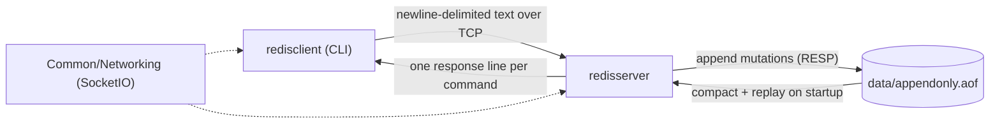
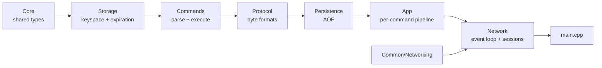
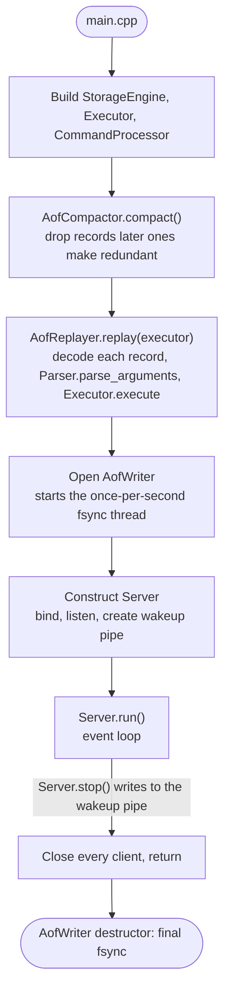
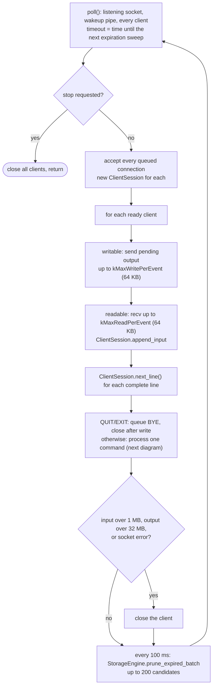
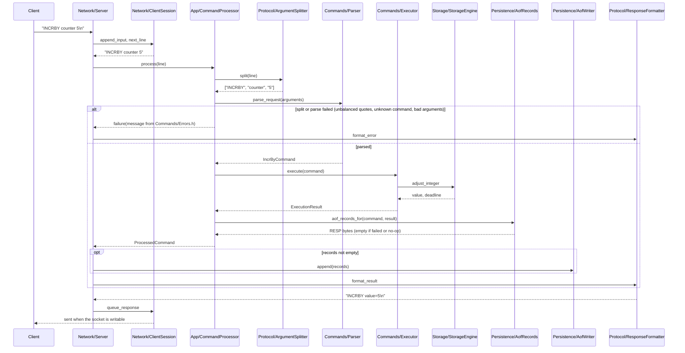
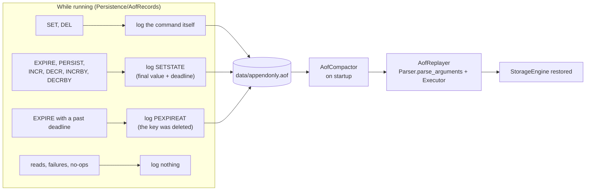

# My implementation of Redis

The project currently includes:

- a single-threaded, `poll()`-based TCP server with a simple newline-delimited text protocol
- a CLI client for interactive testing
- byte-string keys and values that preserve the supplied representation
- key expiration with lazy pruning and periodic event-loop sweeps
- binary-safe RESP-framed append-only logging for durable mutation replay
- unit and integration tests for every server module and the client

## Current Status

This is a working educational systems project, not a Redis-compatible clone.

Implemented today:

- `SET`, `GET`, `DEL`, `EXISTS`, `EXPIRE`, `TTL`, `PTTL`, `PERSIST`,
  `INCR`, `DECR`, `INCRBY`, `DECRBY`, `QUIT`, `EXIT`
- append-only log writes for mutating commands
- log replay on server startup
- multiple concurrent client sessions on one nonblocking event-loop thread
- buffered partial reads and writes
- absolute expiration timestamps in the AOF
- separate CMake projects for the server and client

Not implemented:

- RESP / Redis protocol compatibility
- transactions, replication, snapshots, pub/sub, or clustering
- advanced data structures beyond scalar values

## Supported Commands

Commands are sent as one line each.

- `SET <key> <value>`
- `GET <key>`
- `DEL <key>`
- `EXISTS <key>`
- `EXPIRE <key> <seconds>`
- `TTL <key>`
- `PTTL <key>`
- `PERSIST <key>`
- `INCR <key>`
- `DECR <key>`
- `INCRBY <key> <amount>`
- `DECRBY <key> <amount>`
- `QUIT`
- `EXIT`

### Arguments and values

Every argument is decoded as a byte string, and keys and values are stored exactly
as sent: `GET 007` reads key `007`, not `7`. Only commands that need numbers parse
them: `EXPIRE` seconds and `INCRBY`/`DECRBY` amounts must be canonical signed
64-bit decimals (no `+`, leading zeros, `-0`, or decimals).

Arguments follow `redis-cli` quoting rules:

- unquoted words are split on whitespace
- `"..."` supports the escapes `\"`, `\\`, `\n`, `\r`, `\t`, `\b`, `\a`, and `\xHH`
- `'...'` is literal except for `\'`
- a closing quote must be followed by whitespace or the end of the line

Responses escape values the same way, so any stored bytes can be returned and
pasted back into a request unchanged (see [Wire Protocol](#wire-protocol)).

Examples:

```text
SET name mark
SET "full name" "Mark S"
SET code 00123
SET bytes "\x00\xff"
GET name
EXISTS code
EXPIRE name 30
DEL code
QUIT
```

### Integer commands

Integer commands interpret stored byte strings as signed 64-bit decimal integers
and write the result back as canonical decimal bytes. Missing keys start at zero.
Existing expiration deadlines are retained. Invalid integers and arithmetic
overflow return an error without changing the key. `INCRBY` and `DECRBY` accept
negative amounts. A malformed amount is an execution error, not a parse error.

### Expiration

`EXPIRE` accepts a relative lifetime in seconds. The server immediately converts
it to an absolute deadline, and the AOF stores the key's value with that deadline
as an internal `SETSTATE` record. Restarting the server therefore does not grant
the key a fresh lifetime.

- `TTL` returns the remaining lifetime in whole seconds.
- `PTTL` returns the remaining lifetime in milliseconds.
- Both return `-1` when the key exists without an expiration and `-2` when the
  key does not exist.
- `PERSIST` removes an existing expiration.

Expired keys are removed when accessed and by periodic sweeps performed by the
server event loop.

## Wire Protocol

The server uses a simple newline-delimited text protocol rather than RESP. Every
response is exactly one line. Values are shown in double quotes and escaped like
`redis-cli` output: `\\`, `\"`, `\n`, `\r`, `\t`, `\b`, `\a`, and `\xHH` for any
other byte outside printable ASCII (including UTF-8, so `é` appears as
`\xc3\xa9`). A value containing a newline therefore cannot split a response.

Example responses:

```text
SET value="C++"
GET value="C++"
GET value="line one\nline two"
EXISTS exists=true
EXPIRE applied=true
TTL ttl=29
PTTL ttl_ms=...
PERSIST removed=true
INCR value=1
INCRBY value=6
DEL deleted=true
BYE
ERROR unknown command
ERROR wrong number of arguments for 'get' command
```

## Persistence

Mutating commands are appended to `data/appendonly.aof`, relative to the
server's working directory. On startup, the server compacts and replays that file
before accepting clients. See [Durability](#durability) for which records each
command writes.

The AOF is a sequence of RESP arrays whose bulk strings are length-prefixed, so
keys and values containing null bytes, CRLF, quotes, or arbitrary binary data
round-trip exactly. It is not intended for manual editing. Startup rejects
malformed or invalid records instead of silently discarding them. The one
exception is an incomplete final record, which an interrupted write leaves behind:
the server logs a warning, drops it, and truncates the file, as Redis does with
`aof-load-truncated`.
Successful integer commands log an internal `SETSTATE` record containing the
resulting value and its absolute expiration deadline. Successful `PERSIST` and
future `EXPIRE` operations also record their resulting state. This prevents
replay from losing a key whose expiration was removed or extended before the
server stopped.

The default persistence policy is `EVERY_SECOND`. A successful mutation is
appended before its response is queued, while a helper thread calls `fsync()`
approximately once per second. This improves throughput, but a process or
machine crash can lose roughly the most recent second of acknowledged writes.
Clean logger shutdown performs a final synchronization.

## Concurrency Model

- One event-loop thread accepts clients, runs every command, and runs expiration
  sweeps (see [Event loop](#event-loop)), so commands never run concurrently.
- The only other thread is `AofWriter`'s once-per-second `fsync()` helper.
- `Server::run()` owns every client session and descriptor and may run on only
  one thread. `Server::stop()` is the only operation safe to call from another
  thread: it wakes the event loop, which closes the clients and returns. A caller
  running the server on another thread must join that thread before destroying
  the `Server`.

## Architecture

The diagrams below go from the whole system down to a single request. Module
internals, such as how keys expire or how to add a command, live in each
module's README (see [Module documentation](#module-documentation)).

### System



The client and server are separate CMake projects. Both use `Common/` for socket
writes. The server is the only process that reads or writes the AOF.

### Server modules



Each arrow points from a module to the modules that may use it. A module includes
only itself and modules to its left, and headers are always included by module
path, such as `#include "Commands/Parser.h"`.

### Server lifecycle



A malformed AOF stops startup with an error instead of being skipped, except for
an incomplete final record left by an interrupted write, which is dropped with a
warning. Clients are accepted only after replay has finished.

### Event loop



One thread runs this loop and executes every command, so commands never run
concurrently. Per-event read and write budgets keep one busy client from
starving the others.

### One request



A mutation is appended to the AOF **before** its response is queued, so a client
never sees success for a write that was not logged. A failure to write the AOF
terminates the server.

### Durability



Records store absolute deadlines and complete final values, so replay never
depends on when it runs or on the values that came before.
`PEXPIREAT` and `SETSTATE` are internal commands: the AOF parser accepts them,
and the client parser rejects them.

## Module documentation

Each server module has a README with its files, rules, and extension recipes.
Read a module's README before changing it.

| Module | Role |
|---|---|
| [Core](Server/Core/README.md) | Shared types (`Bytes`, `Key`, `Value`), `parse_integer`, visitor helpers. |
| [Storage](Server/Storage/README.md) | The keyspace, its mutex, and key expiration. |
| [Commands](Server/Commands/README.md) | Command types, the parsers, the executor, and error messages. |
| [Protocol](Server/Protocol/README.md) | Every byte format: request lines, response lines, RESP. |
| [Persistence](Server/Persistence/README.md) | Choosing, writing, compacting, and replaying AOF records. |
| [App](Server/App/README.md) | One client command line, from parsing to AOF record. |
| [Network](Server/Network/README.md) | The event loop and per-client sessions. |

`Common/Networking` holds socket I/O shared by the server, client, and tests, and
`Client/Networking` holds the TCP client.

## Repository Layout

```text
redisimpl/
├── Client/
│   ├── Networking/
│   ├── Tests/
│   ├── CMakeLists.txt
│   └── main.cpp
├── Common/
│   └── Networking/
├── Server/
│   ├── Core/
│   ├── Storage/
│   ├── Commands/
│   ├── Protocol/
│   ├── Persistence/
│   ├── App/
│   ├── Network/
│   ├── Tests/
│   ├── CMakeLists.txt
│   └── main.cpp
├── data/
├── README.md
└── TODO.md
```

## Building

The client and server build separately.

### Server

```bash
cd Server
cmake -S . -B build
cmake --build build
```

### Client

```bash
cd Client
cmake -S . -B build
cmake --build build
```

## Running

Start the server:

```bash
./Server/build/redisserver
```

In another terminal, start the client:

```bash
./Client/build/redisclient 127.0.0.1 6380
```

### Docker

Build the server image from the repository root:

```bash
docker build -t redisimpl-server -f Server/Dockerfile .
```

The build context must be the repository root, because the server also compiles
`Common/`. The client image builds the same way:
`docker build -t redisimpl-client -f Client/Dockerfile .`

Run the container and publish the server port:

```bash
docker run --rm -p 6380:6380 redisimpl-server
```

To keep the append-only log across container restarts, mount a Docker volume at the directory the server writes to inside the container:

```bash
docker volume create redisimpl-data
docker run --rm -p 6380:6380 -v redisimpl-data:/app/data redisimpl-server
```

The server opens `data/appendonly.aof` relative to the container `WORKDIR`, so the log path inside Docker is `/app/data/appendonly.aof`.

Example session:

```text
> SET "language" "C++"
SET value="C++"

> GET "language"
GET value="C++"

> EXISTS "language"
EXISTS exists=true

> EXPIRE "language" 10
EXPIRE applied=true

> TTL "language"
TTL ttl=9

> PTTL "language"
PTTL ttl_ms=...

> PERSIST "language"
PERSIST removed=true

> DEL "language"
DEL deleted=true

> QUIT
BYE
```

## Testing

### Server tests

The server test suite covers:

- argument splitting and parsing
- command processing, result outcomes, and response formatting
- executor behavior
- storage engine behavior
- expiration behavior, including `TTL`, `PTTL`, and `PERSIST`
- integer arithmetic, 64-bit bounds, overflow, TTL preservation, and concurrency
- append-only logging, absolute-expiration replay, sync policies, and compaction
- malformed and truncated AOF input
- shared socket writes, including partial writes
- client-session framing and buffer limits
- TCP event-loop behavior with multiple simultaneous clients and clean shutdown

Tests live in `Server/Tests/<Module>/`, mirroring the source layout: for example,
`Tests/Protocol/` holds the tests for `Server/Protocol/`, and `Tests/Common/` covers
`Common/Networking`. Each folder's `CMakeLists.txt` adds a test with one line,
`add_server_test(testName MODULE_LIBRARY)`, using the helper defined in
`Tests/CMakeLists.txt`.

Run them with:

```bash
cd Server/build
ctest --output-on-failure          # every test
ctest --test-dir Tests/Protocol    # one module's tests
```

### Client tests

The client test suite currently covers address parsing and response-buffer handling.

Run them with:

```bash
cd Client/build
ctest --output-on-failure
```

## Notes and Limitations

- The client protocol is newline-delimited text, not RESP.
- Storage, the AOF, and the text protocol are binary-safe: requests and responses
  carry any byte through escapes. Responses are not length-prefixed, so clients
  must unescape values themselves.
- Command execution runs on one event-loop thread and must remain nonblocking.
- The server closes a client that takes more than 10 s to finish a request line, or
  whose pending responses make no progress for 30 s. Idle clients are never closed.
  `redisclient` gives up connecting after 5 s and waiting for a response after 30 s.
- Durability is append-only-log based; there is no snapshotting yet.
- Transactions, replication, pub/sub, Raft, and clustering are not implemented.
- The project is focused on learning core systems concepts, not Redis feature parity.
